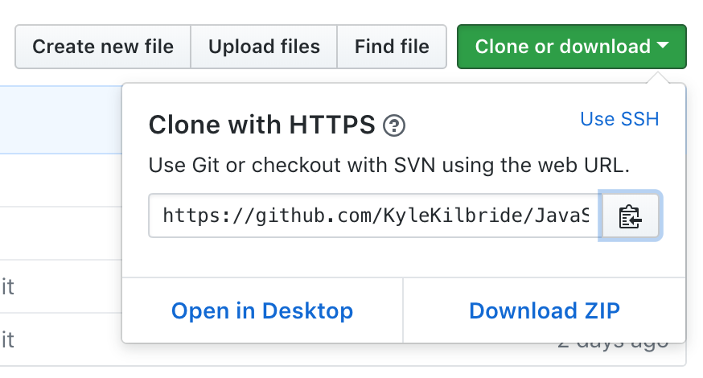

# JavaScript
JavaScript is one of many programming languages that developers use to control what computer systems do. It serves many purposes. From the decisions a system makes to changing what color a background is on a web page. 

I chose JavaScript as a starting language because of its versatility. It can be used in many simple cases, and can be a very powerful language in others. 

## What is code?
Most simply put: Code is a series of instructions. These instructions are then followed by a computer / system. You tell it what to do, then it does it.

Unfortunately, computers won't just do as we say in plain english. So a bunch of smart people invented a language that a computer could understand. At first it was just 0s and 1s. Then machine level language. Then many many others. JavaScript was first known as a scripting language. Its main use was was to change the way things worked in the browser. Change colors, animate things, respond to user inputs. Now it is so much more.

JavaScript has become one of the most powerful programming languages on the planet. It is still used to change colors things in a browser, but now it is also used to create powerful servers and complex algorithms.

## What is GIT?
Git is a version control system. Developers use it to keep track of the changes in their code. It is a incredibly useful tool that all developers should have in their pocket. 

Git allows the use to track their changes and store their code. This way if they mess up, the developer can always revert their changes back to when it worked. 

This website, GitHub, is a place where a developer can publicly and privately store their work. It is used on a personal level as well as an enterprise level. It allows for big and small teams to collaborate and review each others code. 

## Terminal
The terminal is an application on a Mac / PC that allows the user to change things on the computer. It has a lot of the same functionality of a file explorer. It allows you to create, edit, delete files. It also allows you do contact websites and keep track of your files using GIT. 

## Editor
A code editor is something developers use to edit their code. You can always use notepad, or Word, but code specific editors are very powerful tools that let developers code more efficiently and with much higher quality. 

My favorite editor is [Visual Studio Code](https://code.visualstudio.com/), it is a lightweight code editor that packs a powerful punch.

## Getting Started
First thing we will do in this course is utilize GIT to pull this repository. When you `pull` a repository from GitHub it will take the most up to date version of that file-set and put it on your computer to edit.

#### Step 1
Open the `terminal` from your list of applications on your mac. It will look like this. 
When you open the terminal it will open in your home directory. This is the main folder in your computer.

We will start of by using the command `mkdir <folder name>`

`mkdir` stands for make directory. It will create a folder. After this command you will give the folder you want to create a name.

Type in `mkdir code`

This will create a folder in your main directory called `code`! This is where we will put all of the code we will be writing in this course.


#### Step 2
Now we will use the `ls` command.

`ls` stands for list. Using this command will list all files and folders in your current location.

Type `ls` and hit enter. It will show you a list of directories and folders. You should see your `code` directory!


#### Step 3
Now we will use the `cd <folder name>` command.

`cd` stands for change directory. We want to move to the `code` directory that we just created. Type `cd code` and hit enter.


You will know it worked once you hit enter and the command line shows the your are in the `code` directory.

This is where we will download our GitHub Repository!

#### Step 4
A `repository` is a storage space for code.

When you download a repository it is called `pulling`. When you pull a repository it will put the entire up to date code base from the repository into your destination directory.

The syntax is as follows: `git pull <repository address>`

`git` is the command that tells the computer you would like to do something with a git repository.

`pull` is what you want to do with the git repository.

`<repository address>` is the address of the git repository you want to perform an action on. In this case we want to `pull`.

You can find the `<repository address>` in the GitHub link [here](https://github.com/KyleKilbride/JavaScript-for-Beginners)

Click the 'clone or download' button on the repository page. It will look like this:

 

Copy the HTTPS address to your clipboard.

To `pull` this repository we want to type the following command in the `terminal` in our `code` directory:

```bash
git pull https://github.com/KyleKilbride/JavaScript-for-Beginners
```
Once it is `pulled` if you type `ls` in the terminal again you will see the directory called `JavaScript-for-Beginners` with this course!

Now open the code editor we downloaded earlier: VisualStudio Code and open the folder we just `pulled` from GitHub.

Now you have just completed the first unit! Congratulations!

You may move along!

